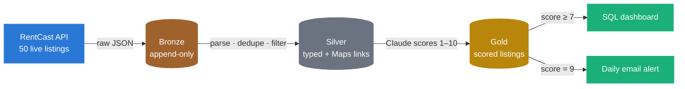

# Wilmington Rental Pipeline


A daily Databricks pipeline that pulls live rental listings for Wilmington, NC, cleans them through a Bronze → Silver → Gold medallion architecture, and has **Claude score every listing against our group's preferences**. It was built to help three UNCW students find the best house to rent, without refreshing listing sites every morning.



## Results

| | |
|---|---|
| Listings ingested and scored per run | **50** |
| Scored 7/10 or higher | **23** |
| Top pick | **3956 Echo Farms Blvd**: 3 bed / 3 bath, $1,749/month (**$583 per person**) |
| Schedule | Pipeline runs daily at 7:30 AM ET, and alerts reach all three of us at 8:00 AM ET |

## How it works

| Layer | Notebook | What happens |
|---|---|---|
| **Bronze** | [`bronze.py`](bronze.py) | Calls the RentCast long-term rentals endpoint and lands each listing's raw JSON in a Delta table with ingestion time and source metadata. Append-only: history is never modified. |
| **Silver** | [`silver.py`](silver.py) | Parses JSON against an explicit schema into typed columns, keeps the latest version of each listing (`row_number()` over `listing_id`), drops rows without a price or bedroom count, and adds a Google Maps link. |
| **Gold** | [`gold.py`](gold.py) | Sends each listing plus our preferences to Claude (Haiku 4.5), parses the structured response and joins it back to Silver as the final table. |

### Claude as the scoring layer

Each listing goes to Claude together with a plain-English list of our requirements:

- ≤ $1,000 per person (≤ $3,000/month for three)
- ≥ 3 bedrooms and ≥ 2 bathrooms, ≥ 1,200 sq ft
- Single-family or townhouse, within ~7 miles of UNCW
- Dealbreakers: over $5,000/month or fewer than 2 bathrooms

Claude has to answer in a fixed JSON contract, which lands directly as Gold columns:

```json
{
  "score": "1–10 match against the preferences",
  "per_person_rent": "monthly rent ÷ 3",
  "pros": "2–3 key positives",
  "cons": "2–3 key concerns",
  "summary": "one-sentence recommendation"
}
```

Using an LLM here replaces a brittle hand-tuned scoring formula. Soft preferences like "reasonable distance" and "townhouse preferred" get weighed together, and each score comes with an explanation a person can check.

### Gold table: `rental_pipeline.gold_listings`

| Column | Source |
|---|---|
| `listing_id`, `address`, `zip_code`, `county`, `latitude`, `longitude` | Silver |
| `property_type`, `bedrooms`, `bathrooms`, `square_footage` | Silver |
| `monthly_rent`, `status`, `days_on_market`, `listed_date` | Silver |
| `maps_url` | Silver (derived) |
| `score`, `per_person_rent`, `pros`, `cons`, `summary` | Claude |

## Tech stack

| Layer | Technology |
|---|---|
| Platform | Databricks (serverless) |
| Storage | Delta Lake |
| Transformation | PySpark |
| AI scoring | Anthropic Claude API (Haiku 4.5) |
| Listings data | RentCast API |
| Orchestration and alerts | Databricks Jobs (daily schedule) |
| Visualization | Databricks SQL dashboard |

## Setup

**Prerequisites:** a Databricks workspace, a [RentCast API key](https://rentcast.io/api) and an [Anthropic API key](https://console.anthropic.com).

1. Clone this repo into your workspace as a Git folder.
2. Store both API keys in a secret scope. The notebooks read them with `dbutils.secrets.get`, so keys never appear in source:
   ```bash
   databricks secrets create-scope rental-pipeline
   databricks secrets put-secret rental-pipeline rentcast-api-key
   databricks secrets put-secret rental-pipeline anthropic-api-key
   ```
3. Run the notebooks in order: `config` → `bronze` → `silver` → `gold`.
4. Optionally, schedule the four notebooks as a Databricks Job and build the dashboard and alert on `gold_listings`. The dashboard and email alert are configured in the Databricks UI, not in this repo.

## Skills demonstrated

- Medallion architecture on Delta Lake: append-only raw layer, deduplicated typed layer, analytical layer
- PySpark schema enforcement, JSON parsing and window functions
- REST API ingestion (RentCast) and an LLM as a structured reasoning step inside a data pipeline (Claude)
- Job orchestration, alerting and dashboarding on Databricks

---

Built by Lukas Nilsson (UNCW) as a portfolio project for data engineering and AI integration roles.
